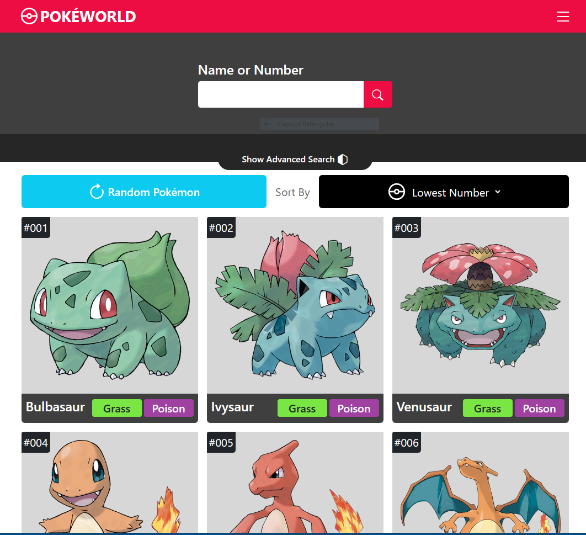
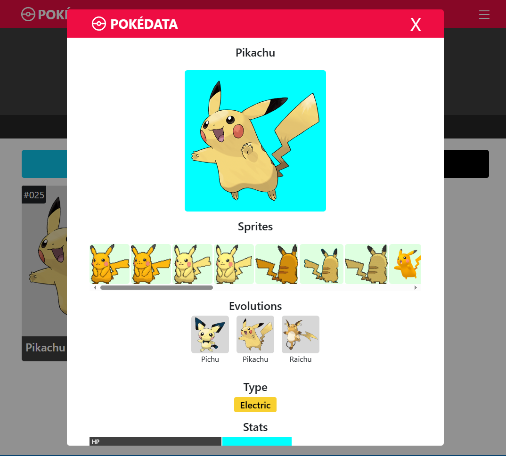
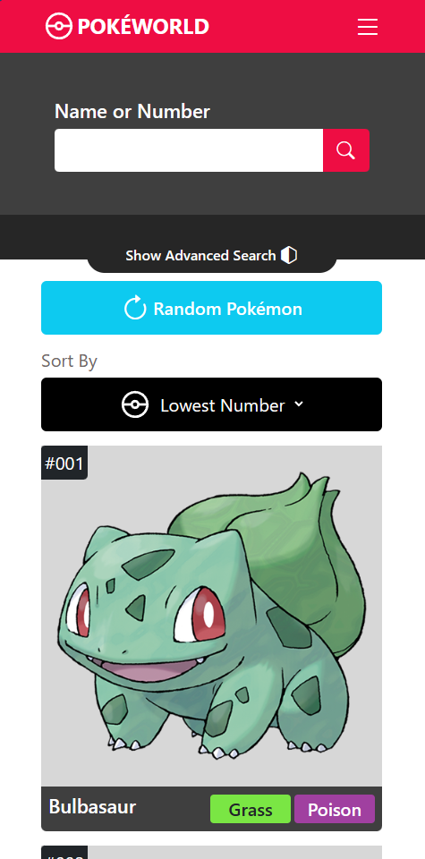

# PokéWorld

This website allows Pokémon fans to have fun discovering more details about their favorite Pokémon. In it, users can see information about each Pokémon, such as its evolutions, type, statistics, movements, game indexes and all its designs/sprites.

Link: https://pokeworld-app.vercel.app/

## Stack

- Vuejs
- JavaScript
- HTML
- CSS
- Bootstrap

## Functionalities
Functionalities:

- Use of VueX for state management
- List of Pokémon
- Infinite scroll
- Filtering for name, id;
- Display of information on a card:
     - All Pokémon sprites;
     - Attack movements;
     - Pokémon evolutions;
     - View all game indexes;
- Responsive design with bootstrap

## Screenshots

